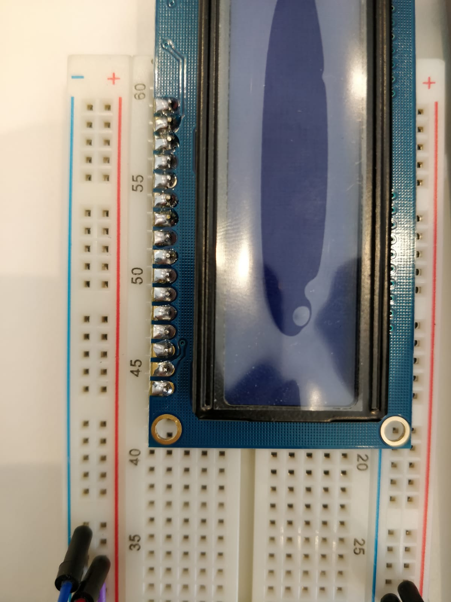
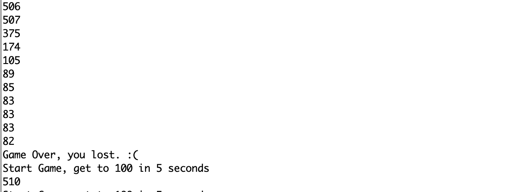
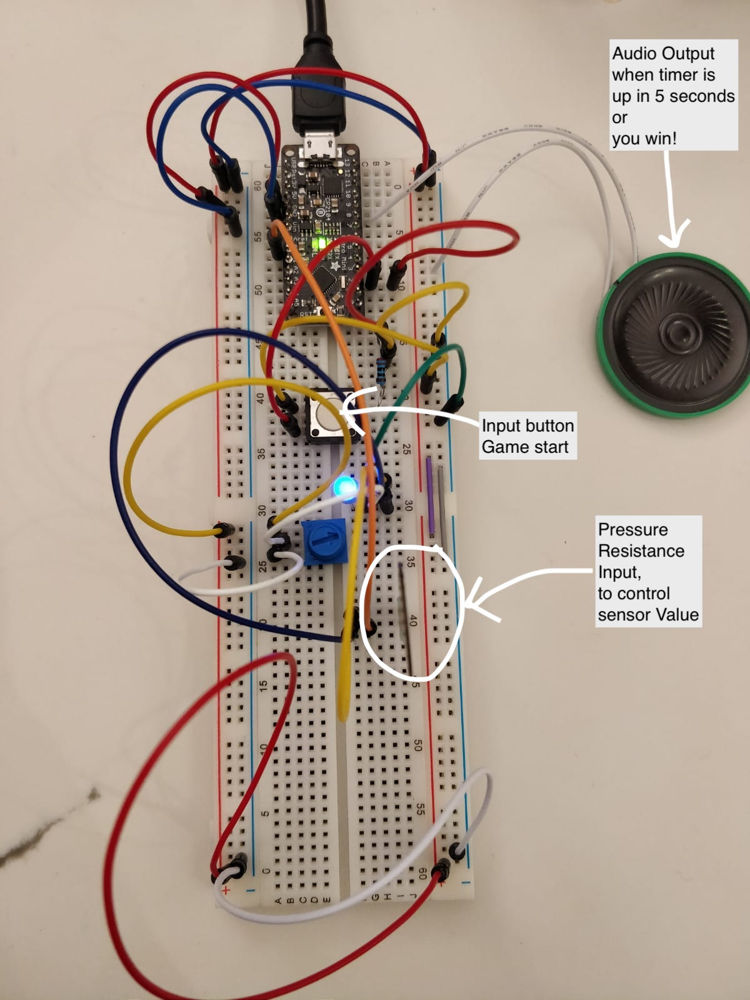

# Digital Timer

## Part A. Solder your LCD panel

**Take a picture of your soldered panel and add it here!**


## Part B. Writing to the LCD
 
**a. What voltage level do you need to power your display?**
5V

**b. What voltage level do you need to power the display backlight?**
5V
   
**c. What was one mistake you made when wiring up the display? How did you fix it?**
None

**d. What line of code do you need to change to make it flash your name instead of "Hello World"?**
```lcd.print("Hello World"); to lcd.print("Ananya Paul");```
 
**e. Include a copy of your Lowly Multimeter code in your lab write-up.**
[Lowly Multimeter Code](./Potentiometer_Voltage_Calculation.ino)

## Part C. Using a time-based digital sensor

**Upload a video of your working rotary encoder here.**
[Rotary Encoder](https://www.youtube.com/watch?v=udxzOorPNVE&feature=youtu.be)


## Part D. Make your Arduino sing!

**a. How would you change the code to make the song play twice as fast?**
```int noteDuration = 1000 / noteDurations[thisNote];```
 
**b. What song is playing?**
Not sure!

## Part E. Make your own timer

**a. Make a short video showing how your timer works, and what happens when time is up!**

[Timer Game](https://photos.app.goo.gl/u2yzh9HTDgzPfvKL8)

I built a timer based game where the player has to press the Pressure Resistor to increase the Resistance and bring the sensor value to 100 in 5 seconds. 

The game starts when the switch on the board is pressed. And the timer of 5 seconds begin. 
If the player is able to come to 100 in 5 seconds, then the player wins the game and the game stops. Celebrating the win with a cool tune. 


If the player can't come to 100 in 5 seconds, the timer expires and the game is lost. The timer stops with an alarm and a different tune is output in the speaker. 


Throughout the game, the player can see the sensor value on the Serial Monitor!

Board setup!


Code for the game!
[Lowly Multimeter Code](./own_timer.ino)


**b. Post a link to the completed lab report your class hub GitHub repo.**


[Link](https://github.com/manification10/IDD-Fa19-Lab2/)
